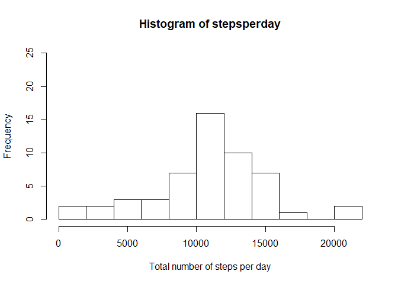
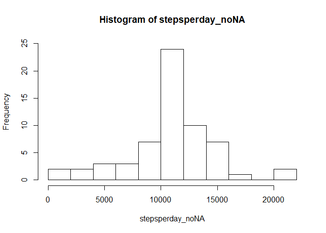
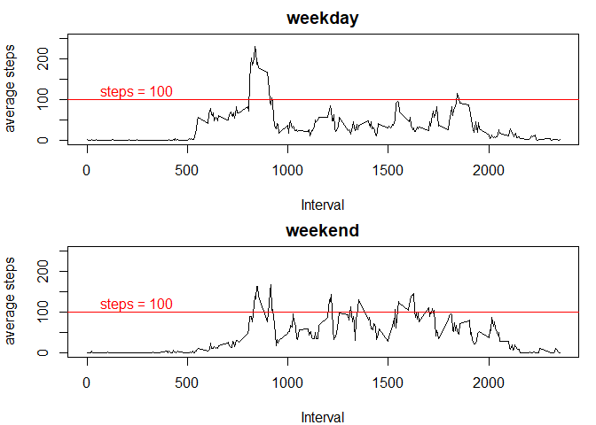

## Loading and preprocessing the data
Show any code that is needed to

1. Load the data

```r
activity <- unzip("activity.zip")
data <- read.csv("activity.csv")
```


2. Process/transform the data (if necessary) into a format suitable for your analysis

Change the format of the date column

```r
data$date <- as.Date(data$date)
```


## What is mean total number of steps taken per day?

For this part of the assignment, you can ignore the missing values in the dataset.

1. Calculate the total number of steps taken per day

```r
stepsperday <- with(data, tapply(steps, date, sum))
```

2. If you do not understand the difference between a histogram and a 3. barplot, research the difference between them. Make a histogram of the total number of steps taken each day

```r
hist(stepsperday, breaks =10, xlab = "Total number of steps per day", ylim = c(0,25))
```

<!-- -->

3. Calculate and report the mean and median of the total number of steps taken per day

```r
c(mean = mean(stepsperday, na.rm = TRUE),median = median(stepsperday, na.rm = TRUE))
```

```
##     mean   median 
## 10766.19 10765.00
```

## What is the average daily activity pattern?

1. Make a time series plot of the 5-minute interval (x-axis) and the average number of steps taken, averaged across all days (y-axis)

```r
stepsperinteval <- with(data, tapply(steps, interval, mean, na.rm = TRUE))
plot(x = names(stepsperinteval), y = stepsperinteval, type = "l", xlab = "interval", ylab = "average steps")
```

<!-- -->

2. Which 5-minute interval, on average across all the days in the dataset, contains the maximum number of steps?

```r
stepsperinteval[stepsperinteval == max(stepsperinteval)]
```

```
##      835 
## 206.1698
```

## Imputing missing values

Note that there are a number of days/intervals where there are missing values (coded as NA). The presence of missing days may introduce bias into some calculations or summaries of the data.

1. Calculate and report the total number of missing values in the dataset (i.e. the total number of rows with NAs)

```r
sum(is.na(data$steps))
```

```
## [1] 2304
```


2. Devise a strategy for filling in all of the missing values in the dataset. The strategy does not need to be sophisticated. For example, you could use the mean/median for that day, or the mean for that 5-minute interval, etc.
In this case we will fill in missing values with the mean for the relevant five-minute interval.
To do this we split the data by interval, use a "for" loop to cycle through each newly-created interval dataset, replacing any "na" values in the variable "steps" with the mean values for that interval previously calculated.

3. Create a new dataset that is equal to the original dataset but with the missing data filled in.

```r
data_split <- split(data, data$interval)

for(i in 1:length(data_split)) {
  data_split[[i]]$steps[is.na(data_split[[i]]$steps)] <- stepsperinteval[i]
}

data_noNA <- unsplit(data_split, data$interval)
```

4. Make a histogram of the total number of steps taken each day 

```r
stepsperday_noNA <- with(data_noNA, tapply(steps, date, sum))
hist(stepsperday_noNA, breaks =10, ylim = c(0,25))
```

<!-- -->

Calculate and report the mean and median total number of steps taken per day.

```r
c(mean = mean(stepsperday_noNA),median = median(stepsperday_noNA))
```

```
##     mean   median 
## 10766.19 10766.19
```

Do these values differ from the estimates from the first part of the assignment? What is the impact of imputing missing data on the estimates of the total daily number of steps? The mean is unchanged, however the median moves towards the mean

## Are there differences in activity patterns between weekdays and weekends?

For this part the weekdays() function may be of some help here. Use the dataset with the filled-in missing values for this part.

1. Create a new factor variable in the dataset with two levels – “weekday” and “weekend” indicating whether a given date is a weekday or weekend day.

```r
data_noNA$weekdays <- ifelse(weekdays(data_noNA$date) %in% c("Saturday","Sunday"), "weekend", "weekday")
```

Generate data of mean steps split by weekend/weekday

```r
data_noNA_weekdays <- with(data_noNA, tapply(steps, list(interval, weekdays), mean))
```

2. Make a panel plot containing a time series plot (i.e. type="l") of the 5-minute interval (x-axis) and the average number of steps taken, averaged across all weekday days or weekend days (y-axis). See the README file in the GitHub repository to see an example of what this plot should look like using simulated data.

```r
par(mfrow = c(2,1), mar = c(4,4,2,1))
plot(rownames(data_noNA_weekdays), data_noNA_weekdays[,1], type = "l", main = colnames(data_noNA_weekdays)[1], xlab = "Interval", ylab = "average steps", ylim = c(0,250))
abline(h = 100, col = "red")
text(250, 120, "steps = 100", col = "red")
plot(rownames(data_noNA_weekdays), data_noNA_weekdays[,2], type = "l", main = colnames(data_noNA_weekdays)[2], xlab = "Interval", ylab = "average steps", ylim = c(0,250))
abline(h = 100, col = "red")
text(250, 120, "steps = 100", col = "red")
```

<!-- -->

As you can see from the above graphs, the maximum average steps occurs during weekdays, with over 200 steps on average for that interval. However, the steps are more consistently higher on average on the weekend, with 100 steps per interval being achieved on average at multiple times throughout the day. This is not the case during weekdays.
